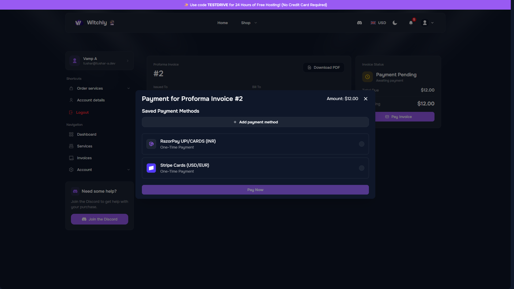

# 💳 Step 2: Checkout & Payment

#### 1. Choose Your Currency 💵

This is important! Look at the top right corner of the checkout page.

* 🇮🇳 Indian Users: Select INR (₹).
* 🌎 International Users: Select USD ($).

<figure><figcaption></figcaption></figure>

#### 2. Create Your Account 👤

You will see a "Sign Up" section. You need an account so we know who to email the server details to.

* Option A (Fastest): Click the blue "Sign up with Discord" button. It’s instant!
* Option B (Standard): Fill in your name, email, and password manually.

<figure><figcaption>
Billing Page Sign-Up Screen
</figcaption></figure>

#### 3. Pay the Bill

The payment method depends on the currency you chose in Step 1:

* If you chose INR (₹): Select Razorpay.
  * _(Inside Razorpay, you can pay via UPI, GPay, Paytm, or PhonePe)._
* If you chose USD ($): Select Stripe.
  * _(Use any Credit or Debit Card)._

<figure><figcaption>
Payment Gateway
</figcaption></figure>

Click "Checkout" to complete the payment.
